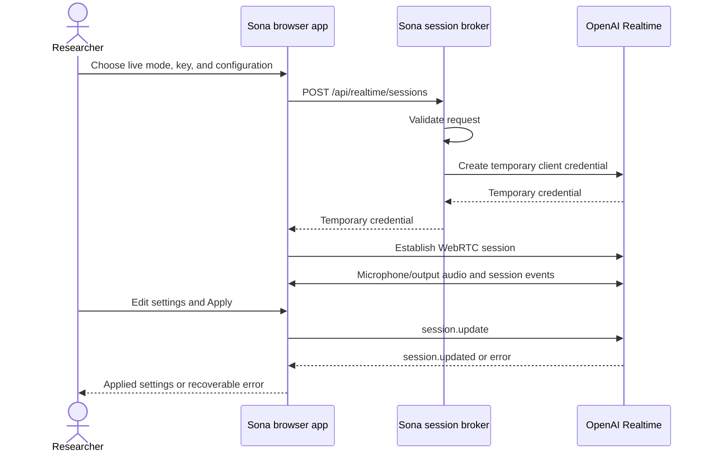

# Architecture

Sona's M1 prototype is a TypeScript workspace with a React/Vite browser app, a Fastify server, and shared Zod-validated contracts. Node.js 24 and pnpm are pinned at the workspace level. The repository contains no persistent research database.

## Runtime and session setup

`POST /api/realtime/sessions` accepts the per-session `apiKey` and a validated `SessionConfig`. The server exchanges the key at OpenAI's `/v1/realtime/client_secrets` endpoint. The browser uses the resulting temporary credential to negotiate WebRTC through `/v1/realtime/calls`. Audio flows directly between the browser and OpenAI; the Sona broker does not record or relay the conversation audio.

The browser owns microphone tracks, playback, the peer connection, and the Realtime data channel. It translates Realtime activity into a transport-neutral session snapshot. The UI renders status, audio level, transcript items, errors, and applied settings from that snapshot. Stop, failure, and component cleanup must release media and connection resources.

Development serves Vite on port 5173, proxying `/api` to Fastify on port 3001. After `pnpm build`, `pnpm start` serves the built frontend and API on port 3001. A public deployment requires HTTPS and a server runtime; static-only hosting is insufficient.

## Configuration behavior

The shared `SessionConfig` validates the current supported model and voice selections, English/Korean response language, instructions, turn detection mode, semantic eagerness, server VAD threshold, and silence duration. The UI does not claim this subset is every OpenAI parameter.

| Setting                                     | M1 apply behavior                                                     |
| ------------------------------------------- | --------------------------------------------------------------------- |
| Model or voice                              | Start a new session                                                   |
| Instructions or response language           | Send `session.update`; wait for acknowledgment                        |
| Semantic VAD and eagerness                  | Send the active turn-detection configuration; wait for acknowledgment |
| Server VAD, threshold, and silence duration | Send the active turn-detection configuration; wait for acknowledgment |

Draft edits must not mutate the applied configuration. An update is pending until confirmed, and rejection or timeout retains the previous applied state. After a timeout, end and reconnect because the remote state cannot be confirmed. The shared conversion functions map product settings to the Realtime request shape. Settings irrelevant to the selected VAD mode are not sent as active parameters.

Requiring a restart for every voice change is a deliberate prototype simplification. OpenAI permits many runtime updates but restricts changing voice after audio output has started. Sona provides a consistent restart boundary instead of depending on whether the current session has spoken. [Realtime conversations](https://developers.openai.com/api/docs/guides/realtime-conversations).

## Credentials and research data

- The researcher enters a long-lived key for session setup. It exists transiently in the browser and broker request; it is not stored in local/session storage, application files, presets, trial objects, or logs. The broker does not retain a global API key.
- Temporary credentials also stay out of logs and exports. Do not return upstream errors or request bodies containing credentials to the UI.
- Session snapshots, transcript items, and events are in-memory prototype state. Local recording and selectable export are planned M2 capabilities, not implemented persistence.
- Live audio and session content reach OpenAI as part of the selected API session. Device-local research storage does not mean live inference runs offline.
- M1 exposes no service tools and sets Realtime tools to an empty list. Guided OAuth connections, secret storage for integrations, custom MCP, and hosted isolation require their own implementation and validation before release.

## Simulation and extension points

Simulation uses deterministic synthetic conversation and activity. It must not request a microphone, mint a credential, call OpenAI, or execute a real service action. It supports repeatable development and browser checks; it does not validate model quality, live voice timing, or integration parity.

The shared package supplies initial extension contracts:

| Contract                         | Purpose and current limit                                                                                                                   |
| -------------------------------- | ------------------------------------------------------------------------------------------------------------------------------------------- |
| `CapabilityDefinition`           | Declares a service action's status, read/write effect, verification date, and Plus/Pro reference; no verified service catalogue ships in M1 |
| `ToolExecutionRequest`           | Describes the action, arguments, simulation/live mode, and confirmation policy; no live tool executor ships in M1                           |
| `TrialEvent` and `TrialManifest` | Define event/configuration data and a capability version for future local records; no recording/export pipeline ships in M1                 |

Keep provider event details in the transport layer. Add future tool execution through the capability registry and explicit confirmation policy, with simulation separated from live execution. A status of planned or unavailable is not executable.

## Validation and API references

Unit tests and browser fixtures cover configuration validation, credential brokerage, session lifecycle, interruptions, denied microphone access, disconnections, and update acknowledgment/failure. CI runs without paid API calls or real service writes. A live smoke test is an additional check, requires a researcher-supplied key, and must be reported separately; mocks cannot establish live account access or audio performance.

API design reference checked **2026-09-23**:

- [OpenAI Realtime WebRTC](https://developers.openai.com/api/docs/guides/voice-webrtc?api=realtime): ephemeral credential brokerage and direct browser WebRTC.
- [OpenAI Realtime event reference](https://developers.openai.com/api/reference/resources/realtime): response completion status and sanitized failure handling.
- [OpenAI Realtime conversations](https://developers.openai.com/api/docs/guides/realtime-conversations): session events and acknowledged configuration updates.

Recheck current official documentation before changing API behavior. These links establish the transport design, not personal ChatGPT integration capabilities; the latter require the separate [M3 catalogue work](https://github.com/studio-glhf/Sona/issues/8).
