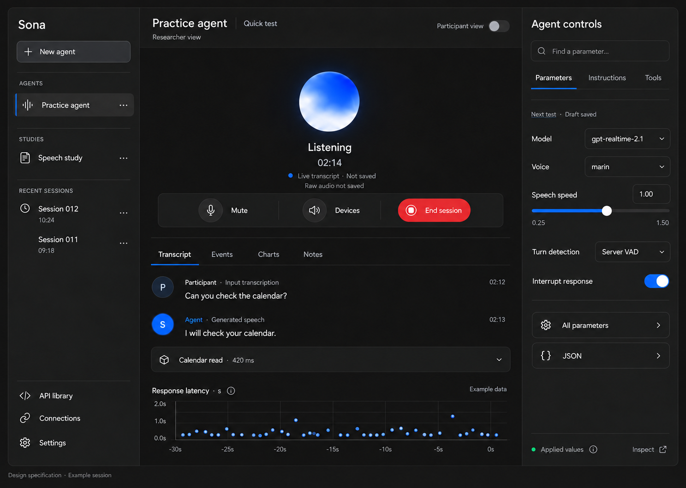
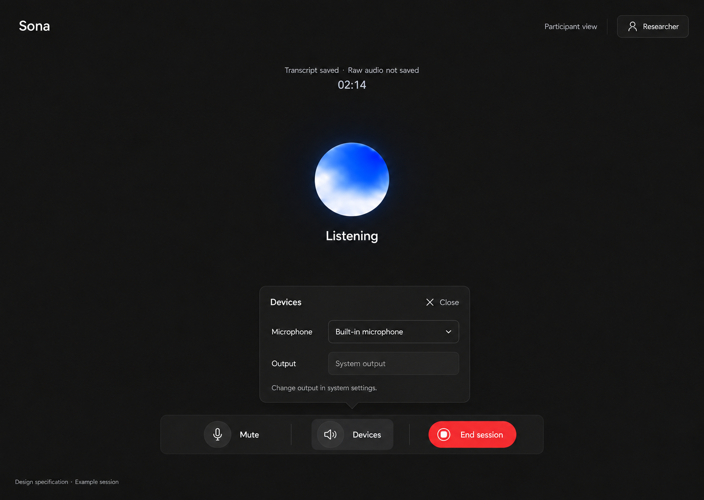
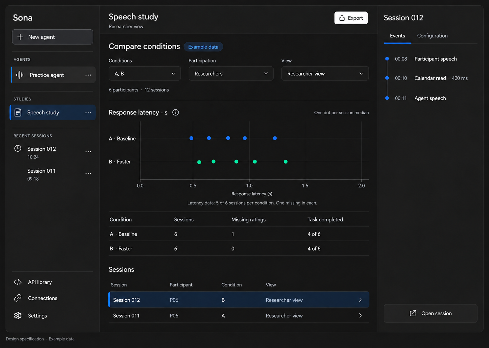

Product and interaction design · Final design baseline

This document defines Sona and its interface. It replaces version 0.6 and the earlier layout alternatives.

**Product status:** The requirements and layout form the design baseline. Application development and service tests are separate work. The figures show the specified interface with example data.

**Writing basis:** This document uses ASD-STE100 Issue 9, dated 15 January 2025. The editorial review uses the supplied specification directly. It examines meaning, grammar, technical terms, and instructions in context. It does not use an automated compliance checker.

The requirements define the product. The figures illustrate those requirements. API sources define the permitted parameters and values. A figure does not prove that a service or model is available.

## 1. Product and users

Sona is a research tool for voice AI agents. Researchers configure agents, do voice tests, examine evidence, and compare conditions. Teams use the selected configuration in their own agent.

Use only OpenAI technology for AI processing. Let agents connect to external services. Keep agent definitions independent of a particular task or service.

### 1.1 Three roles

One person can have more than one role. The roles describe responsibilities. They do not need separate account types or a role-selection screen.

| Role | Responsibility and access |
|---|---|
| Researcher | The primary user. Any team member, including the product owner, can be a researcher. Researchers configure API parameters, instructions, tools, connections, and experiment controls. They can examine graphs, transcripts, events, configurations, and results. They can prepare studies and export evidence. |
| Participant | The secondary user. A participant speaks with the agent during a controlled session under a researcher's supervision. Participant view gives access to essential session controls. A researcher who is the participant can keep the full researcher workspace. |
| Maintainer | A person who adds functions to Sona and repairs defects. The product owner is the initial maintainer. Other team members can become maintainers. A maintainer can also be a researcher or participant. |

A researcher does not need maintainer status to use API parameters, tool definitions, diagnostics, or configuration exports.

Maintainers need source code, setup instructions, release records, and failure reports. The product does not need a separate maintainer dashboard. Maintainer status does not give automatic access to participant records or account secrets.

### 1.2 Researcher participation

A researcher can speak with the agent and examine the session at the same time. Researcher view is the default for quick tests and study runs. Participant view is off by default.

Researcher participation does not remove researcher access. The researcher can see transcripts, charts, tool events, prompts, and configurations. The researcher can prepare changes for the next test.

A measured run uses a fixed condition. Full researcher access does not change that condition silently. The applied configuration stays fixed until the run ends. Section 3 defines how edits become a new revision.

Consent, recording status, and action approval also apply when a researcher is the participant. A researcher is not automatically a participant in every session. The study record identifies the participant with a study-specific code.

### 1.3 Product boundaries

| Subject | Requirement |
|---|---|
| Local installation | Use one browser application and one local Node server on each laptop. An internet connection is necessary. |
| Initial environment | Use desktop Chrome on Windows and macOS. Publish the combinations that pass tests on laptops. |
| Voice | Give spoken agent answers in English or Korean. Researcher evidence can include text and graphs. |
| Accounts | Let researchers connect personal Google accounts and accounts from different Google Workspace organizations. Keep each account's permissions separate. |
| API scope | Include all public OpenAI APIs and applicable parameters that OpenAI offers at the release baseline. Section 7 defines the source records. |
| Study records | Store records on each laptop in a separate database. Share only configurations and evidence selected for export. |
| Audio storage | Do not keep raw participant audio by default. Before study capture, get consent. |
| Portable agents | Use the same configuration contract in Sona and the example agent runtime. Keep credential bindings outside that contract. |

Two teammates must be able to use the same configuration with their own authorized connections. Each teammate must be able to complete the same study procedure.

Complete the core voice functions first. Record incomplete API functions until the full release meets its requirements. A first voice release does not satisfy the full API coverage requirement.

## 2. Workspace and procedures

Use one researcher workspace for agent preparation, voice tests, studies, and evidence. Keep the current agent and condition in view. Keep drafts, selections, filters, and scroll positions when the researcher changes panels.

The left sidebar contains Agents, Studies, and Recent sessions. API library, Connections, and Settings are available at the bottom. Use one navigation list.

The center contains the session and its evidence. The right panel contains agent controls. Put the Participant view control in the session header. Its default state is off.

### 2.1 First setup

1. Configure OpenAI API access.
2. Select the microphone and output device.
3. Do a functional test of the selected devices.
4. Add an agent or import its configuration.
5. Add the connections that the agent needs.
6. Do a check of each necessary connection.

After successful checks, save the device and account selections locally. Show missing requirements adjacent to Start. Give a repair control for each problem. Keep the current draft after authentication.

Do not record background audio during readiness checks. Do not make paid model calls during automatic background checks. Keep browser permission prompts that are necessary for device access.

### 2.2 Quick test

Quick test lets a researcher try an agent without a study form. It connects to OpenAI and the selected external tools. Researcher view stays open.

1. Open an agent.
2. Change the settings for the test.
3. Select Start quick test.
4. If acceptance is necessary, accept the processing notice.
5. Speak to the agent.
6. Select End session.

Save draft changes automatically. Do not make a participant code, questionnaire, or manual version name necessary for a quick test.

Show live transcripts, events, charts, and configuration evidence when those data are available. Before processing, show whether input transcription is active. Input transcription can add service costs.

Do not save study transcripts, ratings, or notes by default. Keep live evidence in memory until the researcher closes the result or starts another test. Show Live evidence — not saved.

Save the configuration snapshot and the necessary redacted action journal. The journal is necessary for tool recovery and duplicate prevention. Give its purpose and retention period.

A study recording needs a new session and applicable consent. Do not add earlier quick-test speech to study evidence. A preview of Participant view must not activate the microphone.

### 2.3 Study preparation

Give one study form with optional fields. Include the research question, task, conditions, order, measures, and consent policy. Save changes automatically.

Let the researcher copy a condition in place. Select the new name for text entry. Show the differences between conditions. Keep this work in the same workspace.

Give manual condition selection and AB/BA ordering. For more conditions, give a list of their order. Record changes to the planned order. Show the session count and estimated duration.

Each condition includes a planned session view. New conditions use Researcher view. The researcher can select Participant view for a supervised participant session.

Record whether the participant is also a researcher. Use this fact for comparison filters. Do not infer this fact from the selected view.

Show the session burden of large condition combinations. Keep comparisons focused. Do not make a full factorial study automatically.

### 2.4 Study run

1. Select Start run.
2. Enter or select the participant's study code.
3. If consent is missing, get the participant's consent.
4. Make sure that the condition and session view are correct.
5. Select Start.

Use one form for the missing information. Let a researcher select their own study code. Do not change their interface because they are the participant.

Start begins the readiness checks, snapshot storage, provider connection, and configuration checks. Show progress in the same workspace. Do not add a Next control for each internal state.

If Participant view is off, keep Researcher view open. If Participant view is on, open the minimal interface before capture starts.

If a necessary check fails, prevent study capture. Keep the entered information. Show the cause and its repair control in the same view.

### 2.5 End and next condition

End session stops microphone capture immediately. It prevents new tool actions and keeps the session record. It does not cancel an external action already in progress.

In Researcher view, keep the workspace open after the session. Show outcomes, notes, and the configured ratings in place. Do not add a return screen for a researcher who is the participant.

In Participant view, show the configured ratings without researcher evidence. Let the participant skip a rating. Record skipped answers as missing data.

After Participant view, use a neutral handoff screen. Show research evidence only when the researcher selects Return to researcher view. Do not reveal notes automatically.

Suggest the next condition from the recorded order. Do not start the condition automatically. Reuse consent only for its applicable participant, policy, and session scope.

### 2.6 Interaction targets

These targets apply after successful setup. They are design targets, not measured results. Count text entry, consent responses, and provider prompts as separate actions.

| Task | Target | Condition |
|---|---|---|
| Repeat a quick test | One Start activation | Setup and the processing notice apply. |
| Change a parameter | Edit the field directly | The field edits a draft. No Save activation is necessary. |
| Copy a condition | Open its menu, then select Duplicate | Edit the name in place. |
| Start a study run | One compact form and Start | Collect only missing information and necessary consent. |
| Start the next condition | One Start next run activation | Consent and readiness checks apply. |
| Use Participant view | One switch activation | Keep the same session and configuration. |
| Stay in Researcher view | No action | Participant view is off. |
| Select a device | Open Devices, then select the device | Browser permission can add a provider step. |
| Examine evidence | Select its tab or session row | Keep the session context. |
| Repair a connection | Select Reconnect | Keep necessary provider authentication steps. |

Do not remove consent or action approval to meet these targets. During usability tests, record repeated steps and loss of context.

## 3. Configurations and conditions

Save drafts automatically after a short input delay. During a write, show Saving. After successful storage, show Saved. If storage fails, keep the entered text.

Keep draft storage, saved revisions, provider acceptance, and observed behavior separate. A saved draft does not prove that the provider applied its settings.

| Record | Meaning |
|---|---|
| Draft | Editable instructions, settings, tools, and policies. |
| Configuration revision | A named version that cannot change. |
| Condition | A study item with a fixed configuration revision and experiment controls. |
| Session snapshot | The requested agent configuration and study controls for one session, without changes. |
| Provider evidence | Returned settings or evidence that the provider accepted a request. |
| Observed evidence | Recorded events, tool results, outcomes, and researcher observations. |

When a quick test starts, Sona saves a snapshot of the current draft. A study run uses its assigned revision. Changes to a saved condition make a new revision.

Before a new revision enters a study, show the changes to the researcher. Let Start next run save and assign that revision in one action. Show the version that this action will use.

During a call, keep all researcher controls accessible. The right panel edits the next-test draft. Show Next test above those fields. Show the applied configuration in a separate, read-only view.

A field change must not change the current call. The initial release uses a new call to apply a draft. The capability record still states when the provider permits a live change.

During a measured run, keep the applied condition fixed. Record view changes and device changes as events. Mark changes that break the planned condition. Keep those runs out of controlled comparisons by default.

If snapshot storage fails, prevent the measured run. Keep the draft for repair. Give version history and a comparison of changed fields.

Store unchanged prompt text, model identifiers, settings, tool definitions, and policy versions. Record source revisions and tool schema hashes where available. If a necessary tool schema changes, get approval before the next run.

## 4. Final interface layout

The design uses one workspace and one optional participant surface. The researcher workspace is the primary interface. These surfaces belong to the same application and session.

Use the dark ChatGPT reference for the visual design. Use Sona branding. Do not imply that Sona is an official OpenAI product.

### 4.1 Researcher workspace

*Figure 1. Researcher view. The researcher can speak with the agent and examine evidence. Participant view is off.*

| Area | Contents and behavior |
|---|---|
| Left sidebar | Agents, Studies, and Recent sessions. Keep API library, Connections, and Settings at the bottom. |
| Session header | Agent name, condition, version, and session type. Keep the Participant view switch here. |
| Voice area | Voice state, elapsed time, and recording status. Use a small voice indicator. |
| Session controls | Mute, Devices, and End session during a call. Start replaces End session before a call. |
| Evidence area | Transcript, Events, Charts, and Notes. Each tab uses the same session and time range. |
| Right panel | Parameters, Instructions, and Tools. Search and JSON give access to the full parameter structure. |

Keep live evidence in the center. Do not give the voice indicator most of the screen. A researcher who is the participant needs the evidence and controls at the same time.

Use Transcript as the initial evidence tab. Keep the last selected tab for that researcher. The Events tab shows tool arguments, results, timing, and failures with redaction.

Charts shows response latency, tool latency, and session events. Section 8 defines each measurement. A selected event opens its details beside the timeline. Close those details without loss of filters or position.

The right panel uses the position of Outputs in the supplied ChatGPT reference. It contains agent controls, not generated files.

### 4.2 Agent controls

Show common parameters first. Give search across labels and API field names. When a search finds a field, open its group. Then select the field.

Give Form and JSON views of the same draft. Keep their values in agreement. Apply the same validation and permissions to both views.

Put instructions and tool connections in their own tabs. Keep API parameters separate from prompt guidance and application controls. Do not describe prompt guidance as a guaranteed model effect.

Each parameter needs its documented values, default, model restrictions, and change timing. Put this information in field details. Keep routine edits in the current panel.

Show requested values and applied values as separate records. If the provider does not return a field, show Sent with that limitation. Do not use Saved to mean Applied.

Tools shows the connected account, selected tools, permission policy, and connection state. A connection repair returns to the same draft. Full OpenAI API functions are available through API library.

### 4.3 Participant view

*Figure 2. Participant view. The researcher selects this interface for a supervised session. Agent answers are spoken.*

Participant view has a voice indicator, state text, elapsed time, and recording status. Its controls are Mute, Devices, End session, and Researcher.

Devices opens microphone and output selectors in one small panel. The panel also has a Close control. It does not expose agent parameters or connection credentials.

Hide research navigation, transcripts, graphs, prompts, conditions, tool results, and researcher notes. Do not show visual agent answers or Calendar confirmation cards.

The agent reads action details aloud. It tells the participant to approve or reject the proposal through speech. Section 6 defines the approval policy. Interface controls do not replace that policy.

### 4.4 Comparison view

*Figure 3. Comparison view. The chart values illustrate the layout. They are not research findings.*

Open comparisons from a study in the same workspace. Show the conditions, sample counts, missing results, and session rows. Let the researcher filter by session view and researcher participation.

Use graphs for measured values. Use text for task outcomes and coded events. When the researcher selects a session, its evidence opens beside the comparison.

Show Export in the comparison header. Show the export scope before download. Do not add a separate export wizard for a routine saved selection.

### 4.5 Visual and access rules

| Element | Requirement |
|---|---|
| Surfaces | Main: `#181818`. Sidebar: `#212121`. Controls: `#292929`. |
| Text | Primary: `#f5f5f5`. Secondary: `#b4b4b4`. |
| Dividers | Use restrained lines such as `#3c3c3c`. Measure the contrast of control boundaries. |
| Type | Use a system sans-serif font. Use 14–16 px for interface text. |
| Space | Use an 8 px basis. Use space and dividers before borders or cards. |
| Desktop columns | Use a 216–240 px sidebar and a 340–380 px control panel. Let the center use the remaining width. |
| Controls | Use a minimum height of 40 px. Use a minimum touch target of 44 px in Participant view. |
| Color | Blue identifies selection. White identifies the primary action. Red identifies End session. |
| Status | Use text and icons with color. Do not use color alone. |
| Motion | Apply the reduced-motion setting. Make states clear without animation. |

At 1280 × 800, keep the session controls in view. Close the sidebar first. If necessary, let the right panel open as an overlay. Do not make field labels too small.

Give keyboard access to all controls. Keep a logical Tab order and a clear input-focus indicator. When an overlay closes, return input focus to its source control.

Use Cmd/Ctrl+K for workspace search. Do not replace browser Find. Do not assign a global shortcut to action approval or End session.

Keep interface language separate from agent language and transcription language. Give each setting a clear label. During a measured run, keep the configured languages fixed.

## 5. Session views and voice behavior

### 5.1 View selection

Participant view is off for new agents, quick tests, and study conditions. The default researcher workspace includes all research controls and available evidence.

A saved condition can specify Participant view. Before Start, show the planned view with the condition. Do not infer the view from the person's roles.

A view change does not change roles or account permissions. It does not start another session, reconnect the provider, or change the agent configuration.

| Situation | Interface behavior |
|---|---|
| Researcher is the participant | Keep Researcher view unless the researcher selects Participant view. |
| Researcher supervises a participant | Let the researcher select Participant view before handoff. |
| New quick test | Keep Participant view off. |
| Saved study condition | Use its planned view. Show that view before Start. |
| Mid-session view change | Keep the call. Record the old view, new view, and timestamp. Mark a protocol deviation if applicable. |
| Participant selects Researcher | Show the handoff screen. Keep research evidence hidden. Keep call controls available. |
| Researcher resumes control | Show research evidence after Return to researcher view. Do not restart the call. |
| Reload during Participant view | Keep research evidence hidden. Keep the microphone off. Use the handoff screen before the workspace opens. |

The initial release uses a handoff on the same laptop. It does not need a second application, participant account, or remote observer console.

Participant view prevents accidental evidence exposure. It is not an authentication boundary. Do not give an unsupervised user access to a researcher laptop through this view.

### 5.2 Devices and essential controls

Mute stops microphone transmission. It does not cancel remote actions. End session stops capture without an extra confirmation dialog. It also closes the provider call and its control connection.

Give the microphone and output selectors in both views. Show the selected device and its access state. Remember device choices locally after successful use.

Before an input change, stop transmission from the old device. Start the new device only after successful selection. Keep the previous mute state. Do not transmit from two microphones together.

If a device change fails, keep the microphone off. Show the cause and a repair control. Record the interruption and the selected device in the session events.

Use browser output selection when it is available. Otherwise, show System output and instructions for the operating system. Do not show an unavailable browser function as a working selector.

Device changes can affect the experiment. Record them in both views. If a change breaks the condition, mark the session for researcher examination.

### 5.3 Voice states and recovery

Keep connection state, microphone state, recording state, and tool state separate. A muted microphone can coexist with an active tool operation.

| State | Behavior |
|---|---|
| Preparing | Show missing requirements in the current view. |
| Consent needed | Get consent before study capture. |
| Connecting | Show progress and a cancellation control. |
| Configuration check | Compare requested and returned settings. |
| Ready | Let capture start after successful checks. |
| Listening | Show the microphone state. |
| Speaking | Use audio playback events to determine the state. |
| Tool active | Show general activity in Participant view. Show details in Researcher view. |
| Approval needed | Wait for approval of the current proposal. |
| Session ended | Keep evidence according to the session's recording policy. |
| Connection lost | Show recovery controls. Mark the evidence gap. |

These states do not need separate screens. Keep progress in one place. If information or a decision is necessary, get input.

After a reconnect, add a linked segment with the same configuration snapshot. Mark the trial as interrupted. Do not replay a write automatically.

Speech interruption does not prove action cancellation. Record provider cancellation and audio-buffer events separately from tool results. Do not imply that an interruption reverses an external action.

Do tests in English and Korean with laptop microphones and speakers. Include dates, times, interruptions, corrections, and confirmations. Record mixed-language sessions as a separate condition.

Do tests for permission denial, device loss, blocked playback, and recovery. After an application restart, keep the microphone off.

## 6. Connections and external actions

### 6.1 Connection library

If a compatible bridge is available, show Use ChatGPT connections. Also show Add plugin and Add MCP server. For an unavailable function, give the cause.

For each connection, show the source, account, workspace, source version, status, and last successful check. Show the tool count after discovery. Give tool selection, permissions, confirmation policy, and test results.

A plugin installation imports a compatible connection definition. The installation does not execute scripts. Initially, accept descriptive plugin metadata and compatible remote MCP definitions.

Let the researcher select plugin instructions. Get the researcher’s approval before activation. Save their versions with the agent. Do not execute plugin installers or hooks. Do not promise compatibility with ChatGPT-specific widgets.

| Connection state | Necessary behavior |
|---|---|
| Needs configuration | Identify the missing endpoint or OAuth setting. Block dependent runs. |
| Sign-in needed | Give the correct authentication action. |
| Needs verification | Let researchers save drafts. Prevent study runs that need the connection. |
| Ready | Show the successful check and its time. Let the agent use only selected tools. |
| Expired or unavailable | Give reconnect or repair. Keep the intended run. |
| Unsupported integration | Identify the missing function. Do not show installation success. |

### 6.2 Existing ChatGPT connections

Prefer reuse of a teammate's existing connection through an official authenticated runtime. Do not export its credentials. A marketplace page alone is not an executable connection.

Official Codex source includes these interfaces [S12, S13]:

| Interface | Purpose |
|---|---|
| `account/login/start` | Sign in with ChatGPT. |
| `app/list` | Find available apps. This interface is experimental. |
| `mcpServerStatus/list` | Find available MCP tools. |
| `mcpServer/tool/call` | Call a selected MCP tool directly. |

Before you select this route, do tests with a compatible released Codex app-server. Source code does not prove account access or successful connection reuse.

Use the runtime’s sign-in process. Select the correct ChatGPT workspace and connected service account. Prefer direct tool calls. Do not silently add a second reasoning agent.

If an intermediary agent is necessary, record its model, version, cost, and timing. Before you change the execution route, get a design decision.

Do a test of an existing Calendar connection with a read and an approved write. Record if the user needs a new Google authorization grant. Do tests for multiple-account selection, revocation, reconnection, approval, and account separation.

Tool discovery alone is not sufficient for this test. If reuse fails, offer clearly labeled direct MCP authorization. Do the service tests for reads and writes again for that route.

Keep credentials in supported authentication mechanisms. Do not copy cookies or extract runtime credentials. Enforce Sona's own tool allowlist and action policy.

The inspected Codex documentation describes disabled-plugin selections [S12]. Those selections do not filter capabilities. Do not rely on that preference to block tools.

A ChatGPT subscription does not show that Realtime or other API use has payment coverage. Keep connection authentication and API billing separate.

### 6.3 Google Calendar

Use Google Calendar for the first integration with an external service. OpenAI publishes plugin version 1.2.6 and an MCP definition [S6]. The definition identifies `https://calendarmcp.googleapis.com/mcp/v1`.

Published metadata does not prove standalone access. Do checks of the OAuth audience, scopes, tool permissions, and available restrictions. Use only the necessary scopes.

Do not promise the narrow `calendar.app.created` scope for this MCP route. Make sure that the necessary Calendar REST options are available through MCP [S8].

Use a designated test calendar and example appointments. Do not add attendees or send invitations during the first test. Restrict tools and the target calendar where supported.

Before participant trials, apply the necessary restrictions. If a necessary restriction is unavailable, prevent the trial. For mixed accounts, examine organization policies and external OAuth requirements.

Google documents possible seven-day refresh-token expiry for external OAuth apps in Testing [S7]. Examine the applicable conditions. Give reconnection and token-renewal instructions for continued use.

After successful service tests, route selected Realtime function calls through the bridge or direct MCP client. Use the same action journal, redaction rules, allowlist, and approval policy. Record the route and runtime version with each session.

Use native hosted MCP only when its authorization, model, transport, and evidence behavior meet the same requirements. Do not use a marketplace URL as an MCP endpoint.

### 6.4 Spoken confirmation

Keep the agent's configured confirmation policy. If an action needs approval, read the full proposal aloud. Include the action, destination, and material arguments. Then tell the participant to approve or reject the proposal through speech.

Bind approval to the current proposal identifier and argument version. After proposal delivery, accept only a clear affirmative response. Enforce approval in the application, independently of prompt instructions.

These events do not give approval:

- Silence or unrelated speech
- A negative or ambiguous response
- Interrupted proposal playback
- A correction to the proposal
- The model's statement that approval exists
- An expired, canceled, or replaced proposal.

If the arguments change, get a new confirmation. Record proposal delivery and the approval route. Do tests of English and Korean affirmation, rejection, correction, overlap, ambiguity, and expiry.

If reliable spoken approval is unavailable, block the action or disclose the necessary visual approval. Do not bypass host approval to reduce clicks.

Some hosts need their own approval screen. Before the study, tell the researcher about that requirement. If host approval is sufficient and applies to the action, do not add duplicate confirmation.

Export the same confirmation policy to the example runtime. Do not introduce an undisclosed difference between the study and the deployed agent.

### 6.5 Tool failures and repeated actions

Give each action a stable identifier. Store the proposal, approval, dispatch, and result in a durable action journal. Make duplicate approval harmless.

Show request timing, result timing, failures, and recorded attempts. Remove sensitive values before display or storage. Keep approval wait time separate from tool execution time.

If a write times out, show Outcome unknown until reconciliation succeeds. Do not retry an ambiguous write automatically. Where available, use service lookup or idempotency functions.

If a tool does not have these functions, show this limitation. Do not promise exactly-once external execution. Label hidden provider retries as unobservable.

## 7. OpenAI API functions

### 7.1 Scope and source records

Include all public OpenAI APIs and applicable parameters that OpenAI offers at the dated release baseline. Keep the 5 October 2026 source snapshot as the documented baseline. This interface revision does not refresh that source snapshot. Before each release, examine source changes.

The inspected specification contains 354 operations, 227 paths, and 31 normalized path families [S1]. It marks 16 operations as deprecated. These counts describe the source, not implemented or tested functions.

Compare the specification with official guides, lifecycle notices, SDK definitions, and account access. Mark unresolved availability as unverified. Make sure that OpenAI continues to offer each listed operation.

Use the [API inventory](research/API-coverage.md), [CSV inventory](research/openai-api-inventory-2026-10-05.csv), and [JSON inventory](research/openai-api-inventory-2026-10-05.json). Keep the full compressed schema and its source hash. Supplement HTTP records with transport events and model-specific rules.

| Group | Source path families |
|---|---|
| Generation and conversation | `responses`, `chat`, `completions`, `conversations`, `agents`, `assistants`, `threads` |
| Voice and media | `realtime`, `audio`, `live`, `images`, `videos` |
| Retrieval and safety | `embeddings`, `moderations`, `vector_stores`, `safety`, `content_provenance_checks` |
| Files and execution | `files`, `uploads`, `containers`, `skills`, `vaults` |
| Evaluation and customization | `evals`, `fine_tuning`, `batches` |
| Application and accounts | `chatkit`, `models`, `organization`, `projects`, `webhook_endpoints`, `webhook_event_types` |

Label preview and deprecated operations. Keep retired operations only for history and migration. Keep administrative operations separate from participant sessions. Use the necessary project or organization credentials.

Private endpoints, undocumented controls, and ChatGPT product interfaces are outside the public API requirement. Non-voice API functions must not add visual answers to Participant view. Researcher view can show their outputs as evidence.

### 7.2 Parameter editor

Give search by API family, operation, model, and parameter. Show a model selector only when the operation has a model parameter.

Include nested objects, arrays, unions, enums, null values, and omitted values. Include path, query, header, body, and file inputs. Use server-side credential references for sensitive authentication fields.

For each field, record these items:

- Source and source revision
- Type and documented default
- Permitted values and limits
- Applicable model and transport
- Dependencies and settings that cannot operate together
- Preview, deprecation, or retirement status
- The time when a change takes effect.

Show Not documented if the source gives no default. Keep omitted values separate from default values that the caller sends. Do not invent slider limits.

Apply model-specific restrictions before broader shared schemas. Adjacent to the field, tell the researcher why the combination cannot operate. Do not discard fields or substitute a different model silently.

Include documented streaming events, asynchronous jobs, polling, cancellation, pagination, file transfer, and binary results. Identify webhooks that need a public endpoint with network access. Do not tell researchers that all operations can operate in a local installation.

Track cataloging, editing, validation, execution, and live verification separately. Also track account restrictions and lifecycle status. An automatically made form does not show that an integration operates correctly.

Show missing credentials and entitlements as coverage gaps. Do not remove these operations from the requirement. Estimate implementation effort and test costs from the inventory.

### 7.3 Common Realtime controls

The inspected quickstart uses `gpt-realtime-2.1` [S2]. It is a candidate model. Before you set release defaults, do checks of account access, price, and behavior.

These values come from the inspected GA Realtime schema [S1]. They do not define all OpenAI API parameters.

| Control | API contract | Sona requirement |
|---|---|---|
| Voice | Native. Built-in values: alloy, ash, ballad, coral, echo, sage, shimmer, verse, marin, cedar. Default: alloy. | Propose Marin initially. Accept custom voice IDs when the account has permission. Voice cannot change after the first audio output. |
| Speech speed | Native `audio.output.speed`. Range: 0.25–1.5. Default: 1.0. Changes apply between turns. | Show the documented range. This is an audio post-processing multiplier. During comparisons, do not add speed instructions to the prompt. |
| Brevity, tone, language | Prompt guidance through `instructions`. Adherence is not guaranteed. | Save unchanged instructions. Record observed behavior separately. |
| Output limit | Native `max_output_tokens`. Values: 1–4096 or `inf`. Default: `inf`. Tool calls use this limit too. | Record the selected study value. Send it in the request. Do not describe this value as seconds or sentences. |
| Output modality | Native `["audio"]` includes a transcript. `["text"]` selects text output. | Use audio for participant voice sessions. Keep generated transcripts in the researcher view. |
| Server VAD | Native threshold: 0–1. Default: 0.5. Prefix default: 300 ms. Silence default: 500 ms. | Record the selected study values. Send them in the request. Full prefix and silence limits need verification. |
| Semantic VAD | Native eagerness: low, medium, high, auto. Default auto equals medium. Maximum waits: 8, 4, 2 seconds. | Record the selected detector and observed timing separately. |
| Automatic response | Native `create_response`. Default: true. | Show this control when the model and transport accept it. Show its effect on response interruption. |
| Interruption | Native `interrupt_response`. Default: true. | Distinguish speech cancellation from tool cancellation. |
| Input transcription | Optional native setting. Default: off. Transcription runs independently from the voice model. | Enable a supported transcription model for study evidence. Do not identify its output as a full record of model perception. |
| Noise reduction | Native near_field, far_field, or null. Default: null. | Select for the device. Record browser audio processing too. |
| Reasoning effort | Native on supported models. Values in this schema: minimal, low, medium, high, xhigh. Default: low. | Show only values that the selected model accepts. Other APIs can have different defaults. |
| Temperature and seed | No matching fields in the inspected request for a GA Realtime session. | Hide for this session type. Show these controls elsewhere only when official documentation specifies them. Do not promise identical replay. |

Include the other documented parameters in the full editor. Examples include tool choice, audio formats, transcription options, truncation, and session metadata.

Do not present WebRTC-negotiated audio as an arbitrary raw-audio format selection. Block measured trials for unsupported or unverified model and transport combinations.

### 7.4 Configuration evidence

Keep requested values, provider evidence, and observations separate. For Realtime, compare the effective configuration that the provider returns. Before a measured run, record mismatches.

Some APIs do not return each setting. Give those fields the status Sent. Show that the provider did not return the value. Successful request acceptance does not prove each field's applied value.

Provider acceptance does not guarantee prompt obedience. Record model aliases as aliases when an immutable model version is unavailable. Give the limits to reproducibility.

## 8. Study evidence and analysis

Attach the configuration snapshot to each session. Record the participant code, session identifier, timestamps, application version, model, prompt, and available tool versions.

For study runs, record the planned view, initial view, and view changes. Record whether the participant is also a researcher. Keep this study fact separate from account permissions.

Keep participant transcription separate from generated speech transcription. Label the source and partial or final status. Keep the original evidence when a researcher adds a correction.

Generated text can include speech that the participant did not hear. Input transcription is not a full record of model perception. Identify missing events and incomplete transcripts.

Record task success, partial success, failure, or unknown outcome. Include researcher notes, error codes, recovery events, and annotation history. Tool success alone does not prove task success.

Give configurable ratings with specified questions and scale anchors. Suggested measures include clarity, perceived control, and usefulness. Suggested 1–7 scales are not validated questionnaires.

Show counts, medians, ranges, and paired participant differences when available. For each measure and condition, show counts for results that pass validation. Also show missing counts. Keep participant, session, and turn counts separate.

Record exclusions and their reasons. Do not treat repeated turns as independent participants. Do not declare an optimal condition or a meaningful difference without sufficient evidence.

### 8.1 Measurement definitions

| Measure | Definition | Limit |
|---|---|---|
| Response-start latency | Time between receipt of speech-stop and audio-stream-start events. Use one server monotonic clock. | This is not physical speech-end to audible-output latency. Event transport affects the value. |
| Tool latency | Time from local dispatch to result or error for each visible attempt. | Do not include approval wait time. Hidden service retries can stay unknown. |
| Approval wait | Time from completed proposal delivery to recorded approval or rejection. | Record spoken or visual delivery. Mark incomplete playback separately. |
| Interruption outcome | Speech-start during output, cancellation evidence, buffer events, and subsequent behavior. | This does not prove external action cancellation. |
| Response length | Generated transcript length and available audio-stream duration. | Text can include unheard speech. Duration alone does not give the speech rate. |
| Task success | Researcher-coded outcome with evidence for the result. | A completed API request is not sufficient evidence. |

Store the measurement definition version, start event, end event, clock source, unit, and missing-data reason. Do not calculate durations across unsynchronized clocks.

Keep turns with external tool activity separate from other turns. Show tool, service, network, and authentication variability adjacent to voice measurements. These factors can affect comparisons.

Raw audio is not necessary for these initial measures. Without raw audio, researchers cannot do acoustic analysis or listen to the session again.

### 8.2 Graphs and comparison context

Give a session timeline with speech events, tool events, interruptions, and device changes. Give graphs for response latency and tool latency. Use the definitions in Section 8.1.

Show units, the number of observations, and missing values. A missing measurement is not zero. Identify incomplete streams and service failures.

For condition comparisons, show distributions and paired differences when the data permit them. Keep tool durations separate from response durations. Let the researcher open the source session from a graph point.

Show the session view and researcher-participation filters with the comparison. Keep different views and participation groups separate by default. If the researcher combines them, show that decision with the results.

Access to transcripts, graphs, and parameters can affect participant behavior. Do not describe a researcher session as a blind participant test. Keep protocol deviations and exclusions with their reasons.

## 9. Data protection and exports

Before microphone capture for a study, get consent. Apply the same consent policy when a researcher is the participant. Give information about OpenAI processing, external services, transcripts, events, local retention, and the raw-audio policy.

Reuse consent only for the same participant and its covered scope. Make sure that the policy did not change and the consent is applicable. Do not treat silence as consent.

Before participant data collection, examine provider terms and account settings. Sona's storage policy does not control OpenAI or Google retention.

Store study records in the operating system's application-data directory. Keep them outside the Git checkout. Keep credentials out of browser code, study records, logs, screenshots, and exports.

Remove sensitive values before storage or display. Set optional SDK and provider tracing to disabled. Provider tracing is separate from Sona evidence collection.

Use 30 days as the initial retention period. Let the researcher change the policy for the local workspace. Delete expired records at startup. During operation, delete expired records at regular intervals. When Sona does not operate, do not claim deletion.

Give session and study deletion. Tell researchers that exports, backups, provider records, and Calendar events are separate copies or resources. Do not promise forensic erasure from local database deletion.

Export versioned JSON and CSV for configurations, sessions, events, actions, and outcomes. Include identifiers for record joins, units, definitions, source metadata, and missing-data reasons.

Use the same conversion rules for nested CSV fields. Keep the full structure in JSON. Escape spreadsheet formula inputs. Show the export scope and redaction policy before download.

Start an export only when the researcher selects the export control. Do not include credentials, unrelated participants, or unselected drafts. Exported agent configurations do not contain participant evidence or private account bindings.

## 10. Architecture and reusable agents

Use one TypeScript repository. The proposed components are React/Vite, Node/Fastify, SQLite, schema validation, the official OpenAI SDK, and an MCP client.

Use separate components for the API catalog, parameter editor, API execution, voice transport, study records, and connection adapters. Before use, do a check of the optional Codex runtime version. Use its authentication process.

Bind the local server to loopback. Validate browser request origins and local sessions. Restrict execution to reviewed API operations and authenticated connection definitions. Do not make a URL proxy that accepts all destinations.

Send browser audio to OpenAI through WebRTC. Use the documented server connection to control the Realtime call [S3]. On the server, validate the applied settings. Execute only approved tools.

Send only redacted events to the interface. Keep the view state separate from the audio connection and agent runtime. A view change must not reset either component.

Participant view renders only its permitted controls and status. Remove hidden research panels from keyboard navigation and the accessibility tree. Do not read hidden evidence through screen-reader announcements.

Keep credentials on the server in both views. A view switch does not grant account permissions. Participant view is a supervised interface, not a security boundary.

### 10.1 Data objects

| Object | Necessary contents |
|---|---|
| Configuration revision | Instructions, model, native settings, tool schemas, source versions, confirmation policy, schema version, canonical hash, parent revision. |
| API capability revision | Source hash, date, schemas, model and transport rules, lifecycle status, coverage, validation evidence. |
| API request recipe | Operation, specified values, omitted values, file references, and logical credential references. |
| API run | Redacted request, response or stream, usage, request identifiers, and acceptance evidence. |
| Connection binding | Logical name, route, runtime version, account, workspace, endpoint, scopes, test resource, and secret reference. |
| Study and condition | Question, task, fixed configuration reference, measures, planned order, and planned session view. |
| Participant assignment | Study-specific code, researcher participation, consent version, consent state, and condition order. |
| Session | Snapshot, provider evidence, model identifiers, application version, runtime version, devices, times, initial view, and state. |
| View event | Previous view, new view, timestamp, reason, and protocol-deviation state. |
| Device event | Device type, selected device label, result, timestamp, mute state, and evidence gap. |
| Event and transcript | Sequence, event identifiers, response identifiers, tool identifiers, clock source, redacted content, source, and completeness. |
| Action journal | Proposal, approval, operation identifier, dispatch, result, failure or unknown state, attempts, and external references. |
| Outcome | Ratings, anchors, task result, researcher codes, notes, and annotation history. |

Store credentials separately from these records. A generic API run does not automatically add a participant session.

Keep study controls outside the portable agent configuration. The runtime must not need participant roles, session views, or the study database.

### 10.2 Portable configuration

Use `sona-agent.json` as the portable configuration format. Include instructions, settings, API source revisions, tool identifiers, schema versions, and confirmation policy.

Use logical references for credentials and resources. Do not include tokens or private account bindings. For a deployment that needs a bridge, use a separate sign-in.

Use the same validator, configuration translation, connection adapter, and action executor in Sona and the example runtime. Identify necessary runtime dependencies.

Do a test of the exported file with a different local connection binding. Run it without Sona's study database. Reject unknown schema versions and incompatible tool schema changes clearly.

Let researchers export API request recipes separately. Do not automatically add administrative requests to a voice agent. Tell researchers that changes to models or external services can prevent identical replay.

## 11. Recovery and product quality

When a problem occurs, keep the current task. Give the cause and a repair control. Do not replace a service failure with simulated success.

| Event | Necessary response |
|---|---|
| Draft write failure | Keep entered content. Show retry. Do not show Saved. |
| Snapshot storage failure | Block the measured run until storage succeeds. |
| Invalid parameter | Identify the field or combination. Do not silently change its value. |
| Connection in progress | Keep one progress area. Let the researcher cancel the connection. Then remove unused resources. |
| Configuration mismatch | Show requested and returned values. Do not substitute another condition. |
| Authentication expiry | Reconnect to the correct account. Restore the original task afterward. |
| Microphone loss | Show the device problem and repair instructions. Keep action state separate. |
| Network loss | Keep notes and mark the evidence gap. Reconnect as a linked segment. |
| Unknown write result | Reconcile the action before another attempt. |
| Session end | Stop capture and new actions. Keep results from dispatched actions. |
| Application restart | Restore drafts and incomplete records. Keep the microphone off. |
| Unavailable API | Give the access and implementation status. Keep the operation in the coverage report. |

Do tests of keyboard-only operation, focus order, focus return, and screen-reader labels. In Participant view, announce applicable state changes. Do not read private evidence aloud.

Do tests of contrast, reduced motion, 200% zoom, and reflow against applicable WCAG 2.2 AA requirements. Do tests on Windows and macOS laptops. Do not claim accessibility compliance from images alone.

Do tests with a researcher who is the participant and a researcher who supervises another participant.

Make sure that a self-test keeps all research controls and evidence available. Do tests of Participant view selection, handoff, device changes, and restart.

Use representative researchers for usability checks. Do tests of repeat calls, condition duplication, participant runs, failure recovery, and export. Record activations, task time, mistakes, backtracking, and requested assistance.

Compare these observations with the planned interaction targets. Do not invent a percentage improvement. An image does not show that the application is ready for release.

## 12. Delivery and acceptance

### 12.1 Delivery stages

Each stage ends with a runnable result and recorded evidence. A stage number does not specify a calendar deadline.

| Stage | Deliverable | Acceptance condition |
|---|---|---|
| 1. Connection feasibility | Runtime checks, sign-in, tool discovery, Calendar access. | Do tests of account reuse. Report the result clearly. If necessary, do tests of the direct MCP alternative. |
| 2. Voice proof | Local English and Korean calls with one read from an external tool. | On a laptop, do tests of the microphone, speaker, interruption, mute, stop, recovery, and configuration evidence. |
| 3. Configurations and actions | Revisions, imports, selected tools, spoken approvals, action journal. | Complete an approved write to the external service. Reject negative, ambiguous, changed, expired, and duplicate approvals safely. |
| 4. Consent and evidence | Stored sessions, separate transcript sources, timeline, retention, deletion. | Recover after restart. Keep late events, gaps, interrupted sessions, and missing data. |
| 5. Studies and exports | Conditions, ordering, ratings, comparisons, JSON, CSV. | Complete the two conditions. Make sure that displayed records agree with exports. Keep missing-data counts. |
| 6. Full API library | Catalog, editor, validation, execution handlers, source and coverage records. | Account for each necessary operation and parameter. Show each restricted or unverified function. |
| 7. Team release | Setup instructions, example runtime, accessibility and usability checks, verification register. | A different teammate completes setup and uses the exported agent with an independent authorized connection. |

### 12.2 Requirement identifiers

Use these identifiers in implementation and test records.

| Identifier | Requirement | Primary sections |
|---|---|---|
| AG-01 | Add a second agent without changes to application code. | 1, 3 |
| CF-01 | Keep immutable revisions and readable configuration differences. | 3 |
| CF-02 | Validate capability and distinguish requested, accepted, and observed settings. | 3, 7 |
| AP-01 | Account for all necessary public API operations. | 7 |
| AP-02 | Edit and validate all applicable parameter structures. | 4, 7 |
| AP-03 | Execute necessary API formats and report verification gaps. | 7, 12 |
| CN-00 | Before a compatibility claim, do tests of ChatGPT connection reuse. | 6 |
| CN-01 | Import, authorize, discover, and restrict compatible connections. | 6 |
| CN-02 | Save connection sources and tool versions. Examine schema changes. | 3, 6 |
| VS-01 | Do tests of English and Korean voice calls with external services. | 5, 12 |
| VS-02 | Distinguish interruption, mute, stop, disconnection, and recovery. | 5, 11 |
| TL-01 | Complete reads and approved writes with the external service. Block rejected writes. | 6, 12 |
| TL-02 | Prevent duplicate actions and reconcile unknown results. | 6 |
| EX-01 | Give tasks, conditions, ordering, notes, and configurable measures. | 2, 8 |
| EV-01 | Keep snapshots, transcript sources, events, timing, and incomplete evidence. | 8, 10 |
| EV-02 | Compare descriptive results and export connected records. | 8, 9 |
| PT-01 | Run the exported configuration without the study database. | 10 |
| DH-01 | Enforce consent, retention, and documented deletion. | 9 |
| DX-01 | Do a setup test with a different teammate. | 12, 13 |
| UX-01 | Keep context and reduce repeated setup actions. | 2, 3, 11 |
| UX-02 | Give optional Participant view. Keep Researcher view as the default. Complete service tests of spoken confirmation. | 1, 4, 5, 6 |
| UX-03 | Do tests of accessibility, recovery, and laptop layouts. | 4, 11 |
| UX-04 | Keep all researcher controls and evidence available when the researcher is the participant. | 1, 3, 5 |
| UX-05 | Give device controls in both views. Record view changes, device changes, and protocol deviations. | 5, 8, 10 |

### 12.3 Test methods

Use unit and contract tests for validation, redaction, CSV safety, and action state changes. Use integration tests for storage, OAuth state, exports, and tool failures.

Use browser tests for interface behavior. Use devices and external services for voice and Calendar tests. Mocked tools and synthetic audio are not sufficient for a service test.

Do a check of the full API catalog for missing operations and fields. Do tests of nested schemas, unions, defaults, model restrictions, and change timing. Do tests of streaming, file inputs, pagination, jobs, binary results, and necessary callbacks.

Use read-only checks and dedicated test resources by default. Before destructive or billable administrative tests, get the researcher’s permission. Catalog discovery must not start paid jobs automatically.

Keep separate states: Implemented, Service test passed, and Verification needed. Record the version, environment, date, and evidence for each test. Do not give cataloged functions a service-test status without completed tests.

Do browser tests of the default view for new agents, quick tests, and study conditions. Make sure that Participant view stays off until selected.

Do tests of saved view conditions and researcher participation. After a view change, make sure that the session identifier and configuration stay unchanged.

Do tests of input switching while muted and while unmuted. Do tests of output selection and the System output fallback. Make sure that the old input stream stops.

Do tests of the neutral handoff screen, evidence visibility, keyboard access, and screen-reader output. After a reload, keep research evidence hidden if Participant view was active.

Make sure that JSON and CSV exports include participation, views, device events, and deviations. Compare exported records with the displayed session.

The [example experiment](example-validation-plan.md) is optional. It is not a necessary team use case. Technical acceptance tests are necessary for all selected use cases.

## 13. Distribution, costs, and release gates

Document the necessary Node version and locked dependency installation. Give release download, credential setup, startup, and readiness instructions. Document any compatible Codex runtime dependency.

During implementation, do tests of these instructions. Do not present untested commands as a runnable release.

GitHub Pages cannot run the necessary secure server. A hosted release needs authentication, separate user credentials, durable storage, and retention operations. ChatGPT Sites needs verification against these requirements.

Local use does not need a hosting subscription. It uses paid services or services with usage limits. Current prices were inaccessible during planning. Do not invent a dollar estimate.

Before paid testing, record dated official prices. Include uncached input, cached input, output, transcription, storage, generated media, jobs, and external charges where applicable.

Use a short measured pilot to estimate study costs. Label estimates clearly. Do not present them as invoices or guaranteed spending limits. Show unknown charges.

| Release gate | Necessary evidence |
|---|---|
| ChatGPT connection reuse | Same-account read and approved write without a new service grant. Do tests of revocation and account separation. |
| Direct Calendar MCP | Real OAuth, tool discovery, read, and approved write. |
| Mixed-account permissions | Verified scopes, organization rules, and teammate setup instructions. |
| Current API coverage | Reconciled official sources, account checks, and operation-level verification. |
| Model and price | Account access and dated pricing information. |
| Provider data handling | Reviewed terms and account settings before participant data collection. |
| Laptop compatibility | Results from tests of the laptop microphone, speaker, browser, and operating system. |
| Tool cancellation | Tests at each action phase and reconciliation of unknown outcomes. |
| Session views | Researcher access during self-tests, optional Participant view, and recorded view changes. |
| Device selection | Input changes, output changes, browser limits, and recovery on each supported laptop. |

Defer other AI providers, universal ChatGPT app compatibility, executable plugin hooks, ChatGPT widgets, and raw participant audio storage.

Also defer participant camera capture, hardware interfaces, mobile/Safari certification, a telephony interface, shared team storage, advanced statistics, and automatic optimization.

Defer a remote observer console, separate participant accounts, and a maintainer dashboard. The initial release uses one supervised laptop.

These deferrals do not remove documented OpenAI API operations from the researcher API library requirement.

## 14. Sources

The API and connection requirements use these sources. The previous planning work included an examination of these sources. This language revision does not include new provider tests.

Some official websites and the live MCP endpoint were inaccessible in this environment. Sona has no completed participant or Calendar session with external services.

**S1.** [Current OpenAI API specification, pinned revision](https://github.com/openai/openai-openapi/blob/13fa6e7ab9301b00c03af2a5d2f584e7a9b84391/openapi.json).

**S2.** [OpenAI voice quickstart](https://github.com/openai/openai-agents-js/blob/96aa754b69282fef3bf8be2f15897985400ee0a6/docs/src/content/docs/guides/voice-agents/quickstart.mdx).

**S3.** [OpenAI transport guidance](https://github.com/openai/openai-agents-js/blob/96aa754b69282fef3bf8be2f15897985400ee0a6/docs/src/content/docs/guides/voice-agents/transport.mdx).

**S4.** [OpenAI voice configuration/tools guide](https://github.com/openai/openai-agents-js/blob/96aa754b69282fef3bf8be2f15897985400ee0a6/docs/src/content/docs/guides/voice-agents/build.mdx).

**S5.** [OpenAI tracing guidance](https://github.com/openai/openai-agents-js/blob/96aa754b69282fef3bf8be2f15897985400ee0a6/docs/src/content/docs/guides/tracing.mdx).

**S6.** [Published Google Calendar plugin manifest](https://github.com/openai/plugins/blob/5fd93af4cd0c623e020d0cc7e9ce178b4ac1f70f/plugins/google-calendar/.codex-plugin/plugin.json) · [MCP configuration](https://github.com/openai/plugins/blob/5fd93af4cd0c623e020d0cc7e9ce178b4ac1f70f/plugins/google-calendar/.mcp.json).

**S7.** [Google OAuth refresh-token guidance](https://github.com/googleapis/google-api-nodejs-client/blob/01de2bd4b6ce1c0c237756e13cb0320c68577293/README.md#handling-refresh-tokens).

**S8.** [Google Calendar API specification](https://github.com/googleapis/google-api-nodejs-client/blob/01de2bd4b6ce1c0c237756e13cb0320c68577293/discovery/calendar-v3.json).

**S9.** [GitHub Pages documentation](https://github.com/github/docs/blob/main/content/pages/getting-started-with-github-pages/what-is-github-pages.md).

**S10.** [OpenAI Apps SDK examples](https://github.com/openai/openai-apps-sdk-examples).

**S11.** User-supplied ChatGPT desktop screenshot. It gives the visual reference. Do not reproduce its personal sidebar content.

**S12.** [Official Codex app-server protocol](https://github.com/openai/codex/blob/c2f7fe89d87ce853900d0b5cb1f5dc4863e44d73/codex-rs/app-server-protocol/src/protocol/common.rs) · [app-server documentation](https://github.com/openai/codex/blob/c2f7fe89d87ce853900d0b5cb1f5dc4863e44d73/codex-rs/app-server/README.md).

**S13.** [App discovery parameters](https://github.com/openai/codex/blob/c2f7fe89d87ce853900d0b5cb1f5dc4863e44d73/codex-rs/app-server-protocol/schema/json/v2/AppsListParams.json) · [direct MCP tool call parameters](https://github.com/openai/codex/blob/c2f7fe89d87ce853900d0b5cb1f5dc4863e44d73/codex-rs/app-server-protocol/schema/json/v2/McpServerToolCallParams.json).

**S14.** ASD-STE100 Simplified Technical English, Issue 9, 15 January 2025. User-supplied file: `ASD-STE100_ISSUE9.pdf`. This revision uses its writing rules and dictionary. The [official website](https://www.asd-ste100.org/) identifies the publisher. The repository does not include the standard or its dictionary.

## Appendix A. Technical terms

Use one meaning for each term in this document. Keep API identifiers and product names unchanged. The table defines Sona terms. The [term register](technical-terms.md) gives proposed categories under rules 1.5 and 1.12. These terms are not additions to the ASD dictionary.

| Term | Meaning in this document |
|---|---|
| Agent | AI system with instructions, settings, and selected tools. |
| API | Application programming interface. |
| API family | Group of related API operations. |
| API library | Sona view for API operations and parameters. |
| Application server | Local program that handles credentials, provider control, storage, and tool execution. |
| Approval | Permission to execute one specific external action. |
| Action journal | Stored proposal, permission, execution, and result records. |
| Array | Ordered collection of data values. |
| Authentication | Process that validates the identity of an account or service. |
| Authorization | Permission to access a resource or perform an action. |
| Bridge | Runtime connection between Sona and existing provider tools. |
| Callback | Request that another service sends to a configured endpoint. |
| Canonical hash | Content identifier that uses fixed rules for data representation. |
| Condition | Study item with a fixed agent configuration and defined experiment controls. |
| Configuration | Agent instructions, settings, tools, and policies. |
| Configuration revision | Saved configuration version that cannot change. |
| Configuration snapshot | Requested agent configuration attached to a session without changes. The session also records study controls. |
| Consent | Participant agreement to the stated processing and study scope. |
| Credential | Secret or account material that permits authenticated access. |
| CSV | Comma-separated values. A tabular export format. |
| Debrief | Questions and notes after a study run. |
| Default | Value that applies when the caller does not send a value. |
| Deprecated | Still documented, but discouraged or scheduled for removal. |
| Endpoint | Address for a service operation. |
| Entitlement | Account permission for a provider function. |
| Enum | Defined set of permitted values. |
| Event | Recorded occurrence with an identifier and timing information. |
| Participant view | Optional session interface with essential controls and no researcher evidence. |
| Researcher view | Default workspace with agent controls and all available research evidence. |
| Researcher participation | Study fact that identifies a participant who also has the researcher role. |
| Protocol deviation | Recorded difference between the planned condition and the actual session. |
| Form view | Parameter editor with labeled input controls. |
| GA | General availability. A provider release status. |
| Idempotency | Property that prevents duplicate effects from repeated requests, as specified in the service contract. |
| JSON | JavaScript Object Notation. A structured data format. |
| Lifecycle | Availability states from preview through retirement. |
| Loopback | Network address that refers to the same computer. |
| MCP | Model Context Protocol. |
| Model alias | Model name that can refer to different versions over time. |
| Monotonic clock | Clock for elapsed time that does not move backward. |
| Native parameter | Setting with a definition in the provider API. |
| OAuth | Authorization protocol for delegated service access. |
| Parameter | Named input to an operation or session configuration. |
| Participant code | Study-specific pseudonym that replaces a participant's direct identity. |
| Prompt | Instructions sent to an AI model. |
| Quick test | Exploratory call that does not collect study evidence by default. |
| Raw audio | Captured sound data before conversion to text or derived events. |
| Reconciliation | Check of the actual service result after an uncertain action. |
| Redaction | Removal or masking of sensitive values before storage or display. |
| Retention | Period for which Sona keeps a record. |
| Runtime | Software that executes an agent configuration. |
| Schema | Definition of data structure, fields, and constraints. |
| SDK | Software development kit. |
| Session | One voice interaction with its configuration and records. |
| Streaming | Transfer of partial results while an operation continues. |
| Tool | Operation that an agent can call through an external service. |
| Transcript | Text representation of speech, with a recorded source. |
| Transport | Protocol that carries requests, events, or media. |
| Truncation | Removal of data to meet an API limit. |
| Union | Data field that accepts one of several defined structures. |
| VAD | Voice activity detection. |
| Webhook | Configured callback that reports a service event. |
| WebRTC | Protocol technology for real-time browser media connections. |
| Workspace | Researcher view that keeps the current agent and task context. |

Use technical terms only in their specified contexts. A technical noun does not automatically become a permitted verb. Do not use the term register to permit ordinary words that the dictionary does not approve.

## Appendix B. Editorial basis

ASD-STE100 Issue 9 is the reference for the writing. The editorial review examines the requirements as technical specifications. It examines the user procedures as procedural text.

The review considers meaning, grammar, word choice, parts of speech, technical terms, and sentence construction together. It also compares each procedure with the specified interface and product behavior.

The [editorial record](language-review.md) gives the method and the decisions. The [term register](technical-terms.md) defines terms for this subject. Technical terms do not permit unrelated ordinary uses of the same word.

No automated language checker establishes compliance for this revision. Rendering checks examine only the document files, links, images, and page layout. The supplied standard stays outside the repository.
